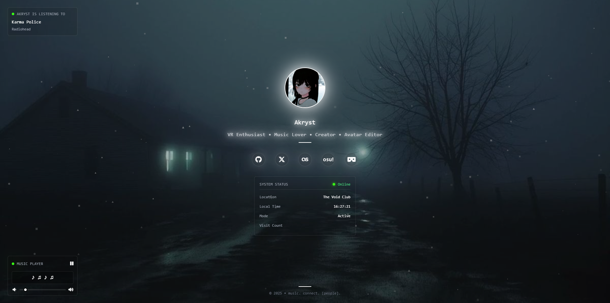

# Meow - Modular & Personal Bio Page

A modern, customizable personal bio page with Discord integration, real-time music display, and dynamic backgrounds.



<p align="center">
   <a href="https://bio.akryst.lol"><b>Live demo</b></a>
</p>

<p align="center">
   <a href="https://discord.gg/zZ9umH8Jja">
      
   </a>
   <a href="https://nodejs.org/">
      
   </a>
   <a href="LICENSE">
      
   </a>
   <a href="https://github.com/Akryst/Meow">
      
   </a>
   <a href="https://github.com/Akryst/Meow">
      
   </a>
</p>

## Features

- **Discord Integration**: Real-time status, decorations, and badges via Lanyard API
- **Music Integration**: Last.fm scrobbling and built-in music player with visualizer
- **Dynamic Backgrounds**: Video/image backgrounds with particle effects
- **Welcome Screen**: Customizable welcome message with fade-in animation
- **Social Links**: Support for 10+ platforms (GitHub, Twitter, OSU!, VRChat, Steam, etc.)
- **Location Display**: Rotating location text with customizable intervals
- **Visual Effects**: Bloom effects with customizable strength and animations
- **Font System**: Dynamic font loading with multiple weight support
- **Modular Design**: Enable/disable any feature independently
- **Responsive**: Works perfectly on desktop, tablet, and mobile

## Quick Setup

```bash
# Clone and install
git clone <repository-url>
cd Meow
npm install

# Configure
cp .env.example .env
# Edit .env with your info
npm run config

# Run
npm start
```

## Setup Instructions

### Discord Integration (Lanyard API)

1. **Join the Lanyard Discord Server**: [https://discord.gg/lanyard](https://discord.gg/lanyard)
2. **Get your Discord User ID**:
   - Enable Developer Mode in Discord (User Settings > Advanced > Developer Mode)
   - Right-click your profile and select "Copy User ID"
3. **Test the API**: Visit `https://api.lanyard.rest/v1/users/YOUR_USER_ID` to verify it works
4. **Add to .env**: Set `DISCORD_USER_ID=your_user_id`

### Last.fm Integration

1. **Create Last.fm API Account**: [https://www.last.fm/api/account/create](https://www.last.fm/api/account/create)
2. **Get API Key**: After creating account, you'll receive an API key
3. **Get Username**: Your Last.fm username (from your profile URL)
4. **Add to .env**: Set `LASTFM_API_KEY=your_api_key` and `LASTFM_USERNAME=your_username`
5. **Start Scrobbling**: Make sure you're actively listening to music with a connected service

## Configuration

Edit `.env` file with your information:

```env
# Personal Info
NAME=Your Name
DESCRIPTION=Your description
TIMEZONE=America/New_York

# Welcome Screen
WELCOME_SCREEN_ENABLED=true
WELCOME_TEXT=Hey! Been trying to meet you.

# Discord (via Lanyard)
DISCORD_ENABLED=true
DISCORD_USER_ID=your_discord_id
DISCORD_UPDATE_INTERVAL=5000
DISCORD_USE_WEBSOCKET=true
DISCORD_SHOW_BADGES=true

# Services (set to false to disable)
LASTFM_ENABLED=true
LASTFM_API_KEY=your_api_key
LASTFM_USERNAME=your_username

MUSIC_PLAYER_ENABLED=true
MUSIC_PLAYER_VOLUME=50
MUSIC_PLAYER_AUTOPLAY=false
MUSIC_PLAYER_TRACKS=["track1.mp3", "track2.mp3", "track3.mp3"]

# Social Links (set to 'off' to hide)
GITHUB=https://github.com/username
TWITTER=https://x.com/username
LASTFM=https://www.last.fm/user/username
OSU=https://osu.ppy.sh/users/userid
VRCHAT=https://vrchat.com/home/user/usr_userid
STEAM=https://steamcommunity.com/id/yourid
INSTAGRAM=off
TIKTOK=off
NAMEMC=off
YOUTUBE=off

# Background
BACKGROUND_TYPE=video
BACKGROUND_VIDEO=assets/videos/background.mp4
BACKGROUND_IMAGE=assets/images/background.jpg

# Location Display (optional)
LOCATIONS_ENABLED=false
LOCATION_INTERVAL=10000
FADE_TIME=1000
LOCATIONS=["Home","Office","Coffee Shop","Creative Space"]

# Visual Effects
BLOOM_ENABLED=true
BLOOM_STRENGTH=0.1
BLOOM_RADIUS=30px
BLOOM_PULSE_ANIMATION=true

# Fonts
FONT_FAMILY=Poppins
FONT_WEIGHTS=300;400;500;600;700
```

## File Structure

```
public/
├── assets/
│   ├── images/profile.jpg     # Your profile picture
│   ├── images/background.jpg  # Background image
│   ├── videos/background.mp4  # Background video
│   └── songs/                 # Your music files
├── css/base/styles.css        # Main styles
└── js/modules/                # JavaScript modules
```

## Commands

- `npm start` - Start server
- `npm run config` - Regenerate config after .env changes
- `npm run serve` - Static files only

## Support & Community

💬 **Need help? Join our Discord server!**
[](https://discord.gg/zZ9umH8Jja)

**Other ways to get support:**
- 🐛 [Report Issues](https://github.com/Akryst/Meow-/issues)
- 💡 [Request Features](https://discord.gg/zZ9umH8Jja)
- ⭐ [Star the Repository](https://github.com/Akryst/Meow-)

## License

Open source - use freely

---

Made with ❤️ by Akryst
