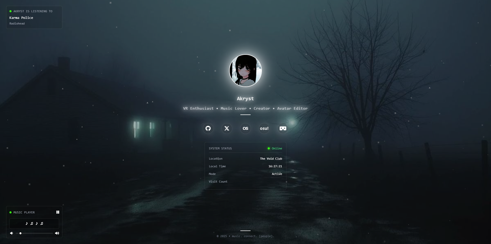

# Meow - Personal Bio Page

A customizable personal bio page with Discord integration, Last.fm, music player, and dynamic backgrounds.

<p align="center">
   <a href="https://bio.akryst.lol"><b>Live demo</b></a>
   &nbsp;·&nbsp;
   <a href="https://discord.gg/zZ9umH8Jja"><b>Discord</b></a>
</p>



## Setup

**1. Install dependencies**
```bash
npm install
```

**2. Configure your `.env`**

Rename `.env.example` to `.env` and fill in your info:
```env
# Required
NAME=Your Name
DESCRIPTION=Your description here
TIMEZONE=America/New_York
FOOTER=Made with ❤️ by You

# Social links (set to 'off' to hide)
GITHUB=https://github.com/username
TWITTER=https://x.com/username
STEAM=https://steamcommunity.com/id/username
INSTAGRAM=off

# Discord (join discord.gg/lanyard first, then paste your user ID)
DISCORD_ENABLED=true
DISCORD_USER_ID=your_discord_user_id

# Last.fm (get your API key at last.fm/api/account/create)
LASTFM_ENABLED=true
LASTFM_API_KEY=your_api_key
LASTFM_USERNAME=your_username
```

After editing, regenerate the config:
```bash
npm run config
```

**3. Add your images**

Drop your files into `public/assets/images/`:
- `profile.jpg` — your profile picture (jpg, png, gif, webp supported)
- `background.jpg` — background image

For a video background, put it in `public/assets/videos/background.mp4` and set `BACKGROUND_TYPE=video` in your `.env`.

**4. Run it**
```bash
npm start
```

The site will be available at `http://localhost:3000`.

## Commands

| Command | Description |
|---|---|
| `npm start` | Start the server |
| `npm run config` | Regenerate config from `.env` |
| `npm run serve` | Serve static files only |

## License

Open source — use freely. Made with ❤️ by Akryst
